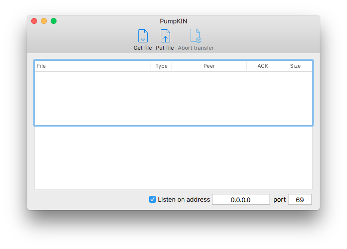

# Pumpkin 
Mac OS X TFTP client/server application

PumpKIN is an open source, fully functional, free TFTP server and TFTP client, which implements TFTP according to RFC1350. It also implements block size option, which allows transfer of files over 32MB, as well as transfer size and transfer timeout options described in RFC2348 and RFC2349.

The primary use of PumpKIN is maintenance of the network equipment (such as router firmware upgrade) that fetches images from TFTP server.

The main PumpKIN features are:

* Fully standard-compliant TFTP file transfer
* Unlimited simultaneous transfers both for TFTP server and client
* Support for TFTP blocksize option allows transfer of large files if both TFTP server and client support it
* Convenient GUI
* Combines TFTP server and TFTP client
* Open source for those willing to add missing features, fix bugs and examine code for potential flaws and fun
* You're free to torture it the way you want to as long as you preserve original author's credentials
* It would cost you nothing unless you're willing to monetarily express your gratitude and make a donation (yes, it means "free" or "freeware", just go and download it) -> http://kin.klever.net/pumpkin

Note that PumpKIN is not an FTP server, neither it is an FTP client, it is a TFTP server and TFTP client. TFTP is not FTP, these are different protocols. TFTP, unlike FTP, is used primarily for transferring files to and from the network equipment (e.g. your router, switch, hub, whatnot firmware upgrade or backup, or configuration backup and restore) that supports using of TFTP server for, not for general purpose serving downloadable files or retrieving files from the FTP servers around the world.

